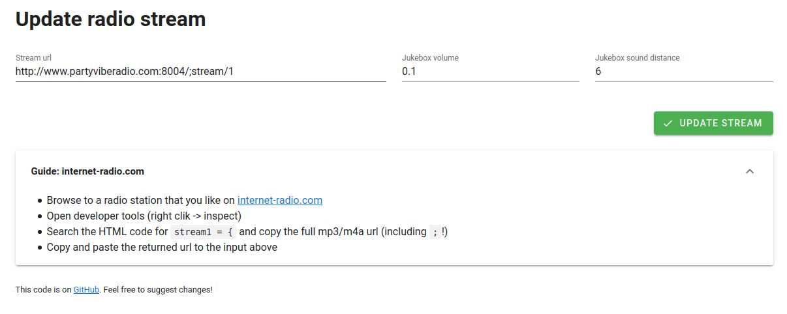

# Gather Radio API tests



Based on https://github.com/gathertown/door-by-api
Provide configurable audio streaming for Gather.

## Features
- Create Jukebox objecs in Gather and let them play any streamable mp3/m4a
- Change streaming url, sound volume and distance in an easy-to-use frontend
- Set unique ids for multiple separate Jukebox radios, or shared ids to control multiple Jukebox radios at once

## Used Technology
- Frontend: Vue, Vuetify
- Backend: Serverless framework to deploy to AWS Lambda and AWS S3

## Deployment Setup

```bash
npm install -g serverless
```

### Invoke the function locally

```bash
serverless invoke local --function stream_url
```

### Deploy

In order to deploy the endpoint, simply run:

```bash
serverless deploy
```
For the frontend in `client/dist` (uploaded to S3), run:
```bash
serverless client deploy
```

### Config
You need to set a `config.js` in the root folder:

```bash
module.exports = {
  ROOM_ID: 'space\\id',
  MAP_ID: 'room-name',
  API_KEY: 'api-key'
};
```
...and a `api.js` in client/dist:

```bash
const apiDeployment = 'https://path/to/your/deployed/api/endpoint';
```

## Gather setup
Create a jukebox object with an embedded website. Use your s3 deployment url and add an unique id after the link to help referencing the correct Jukebox:
```
https://<bucket-name>.s3.eu-central-1.amazonaws.com/index.html?id=<unique id>
```
When using the same id for multiple Jukeboxes, all of them are updated with the next update!